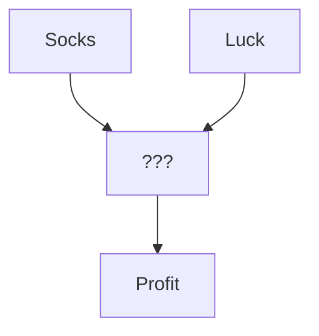

This is my first post on my new blog!


I'm sure I'll write a lot more interesting things in the future, but for now I'll explain markdown files(.md).

# Why use Markdown files

Markdown is a markup language for creating simple formatted documents without the need for a GUI to make bullets, bold. It's meant to help you keep your hands on the keyboard and not on the mouse. Markdown files are often used on github for making docs. So it's good to know the basics for making READMEs and blogs if you are like me.

# History and Use-Case on Markdown Files

Markdown was made for writers not for coders. The main purpose of this technology to be easy to read, easy to write, and easy to convert to HTML. Markdown files help make all the blogs you skim possible, non-technical writers do not need to worry about `h1` tags where they write a blog instead they just need to write `# Title`.

These files have simple formatting rules, is plain-text allowing it to work with git, and more importantly works with vim and emacs. It's developer friendly too, all IDEs work with it out the box. So programmers love it.

# Downsides to Markdown files

First of all Markdown is a super set of HTML. It's susceptible to Cross-Site Scripting attacks(XSS) because its unescaped. For more information why [click here to learn more](<https://github.com/showdownjs/showdown/wiki/Markdown's-XSS-Vulnerability-(and-how-to-mitigate-it)>).

TLDR Avoid taking user information all together if you are using Markdown files. If you are do need to, then handle user info by using of HTML XSS filtering libraries, handle this on the server side not the client side, lastly you need to filter the output not the input.

But if you are using it for Docs or Blogs only, then you don't need to worry.

# Why does my Markdown look different from site to site

Markdown is just like JS, since it used everywhere. Everyone has an option of how it should be handled. Wordpress, Reddit, and many more have site-specific versions of Markdown. Generally speaking the generated HTML do not use any modern elements like `nav` and `picture`. The parser from site to site can be different too, leading to some interesting edge cases.

[Click here for some general rules.](# Cheat Sheet)

# Cool things you can do

Since everyone has an option on Markdown, some useful libraries have been made. Using [Mermaid.JS](https://mermaid.js.org/intro/) you can make some diagrams with markdown.

```
graph TD;
      Socks-->???;
      Luck-->???
      ???-->Profit;
```



You can be as complex as you want

```
quadrantChart
    title Reach and engagement of campaigns
    x-axis Low Reach --> High Reach
    y-axis Low Engagement --> High Engagement
    quadrant-1 We should expand
    quadrant-2 Need to promote
    quadrant-3 Re-evaluate
    quadrant-4 May be improved
    Campaign A: [0.3, 0.6]
    Campaign B: [0.45, 0.23]
    Campaign C: [0.57, 0.69]
    Campaign D: [0.78, 0.34]
    Campaign E: [0.40, 0.34]
    Campaign F: [0.35, 0.78]
```


But this these case I would just import some image, save time where you can.


# Cheat Sheet

Add a image or gif like this

```

```

This is a paragraph.

    This is a paragraph.

# Header 1

## Header 2

    Header 1
    ========

    Header 2
    --------

# Header 1

## Header 2

### Header 3

#### Header 4

##### Header 5

###### Header 6

    # Header 1
    ## Header 2
    ### Header 3
    #### Header 4
    ##### Header 5
    ###### Header 6

# Header 1

## Header 2

### Header 3

#### Header 4

##### Header 5

###### Header 6

    # Header 1 #
    ## Header 2 ##
    ### Header 3 ###
    #### Header 4 ####
    ##### Header 5 #####
    ###### Header 6 ######

> Lorem ipsum dolor sit amet, consectetuer adipiscing elit. Aliquam hendrerit mi posuere lectus. Vestibulum enim wisi, viverra nec, fringilla in, laoreet vitae, risus.

    > Lorem ipsum dolor sit amet, consectetuer adipiscing elit. Aliquam hendrerit mi posuere lectus. Vestibulum enim wisi, viverra nec, fringilla in, laoreet vitae, risus.

> ## This is a header.
>
> 1. This is the first list item.
> 2. This is the second list item.
>
> Here's some example code:
>
>     Markdown.generate();

    > ## This is a header.
    > 1. This is the first list item.
    > 2. This is the second list item.
    >
    > Here's some example code:
    >
    >     Markdown.generate();

- Red
- Green
- Blue

* Red
* Green
* Blue

- Red
- Green
- Blue

```markdown
- Red
- Green
- Blue

* Red
* Green
* Blue

- Red
- Green
- Blue
```

- `code goes` here in this line
- **bold** goes here

```markdown
- `code goes` here in this line
- **bold** goes here
```

1. Buy flour and salt
1. Mix together with water
1. Bake

```markdown
1. Buy flour and salt
1. Mix together with water
1. Bake
```

1. `code goes` here in this line
1. **bold** goes here

```markdown
1. `code goes` here in this line
1. **bold** goes here
```

Paragraph:

    Code

<!-- -->

    Paragraph:

        Code

---

---

---

---

---

    * * *

    ***

    *****

    - - -

```bash
yarn install
```

````markdown
    ```bash
    yarn install
    ```
````

```js
var http = require("http")

http
  .createServer(function (req, res) {
    res.writeHead(200, { "Content-Type": "text/plain" })
    res.end("Hello World!")
  })
  .listen(8080)
```

````markdown
    ```js
        var http = require('http');

        http.createServer(function (req, res) {
            res.writeHead(200, {'Content-Type': 'text/plain'});
            res.end('Hello World!');
        }).listen(8080);
    ```
````

This is [an example](http://example.com "Example") link.

[This link](http://example.com) has no title attr.

This is [an example][id] reference-style link.

[id]: http://example.com "Optional Title"

    This is [an example](http://example.com "Example") link.

    [This link](http://example.com) has no title attr.

    This is [an example] [id] reference-style link.

    [id]: http://example.com "Optional Title"

_single asterisks_

_single underscores_

**double asterisks**

**double underscores**

    *single asterisks*

    _single underscores_

    **double asterisks**

    __double underscores__

This paragraph has some `code` in it.

    This paragraph has some `code` in it.


    
