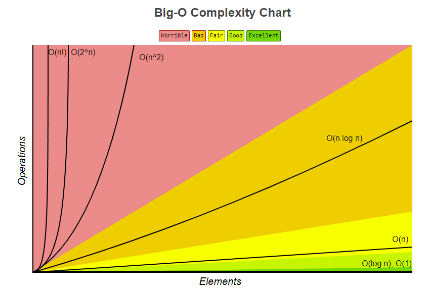

This blog is meant for people who are new to Big-O Notation or people who need a refresher on what Big-O Notation is. If you don't need this this [bigo cheatsheet](https://www.bigocheatsheet.com/), might be more up your alley. It covers common data structure operations and array sorting algorithms.




# What is Big O Notation

Big O notation is a method to tell how fast a algorithm is. This method tracks the operations/steps it takes to get to the solution. This lets us to account for different clock speeds on CPUs. A algorithm is not meausres in seconds, but in terms of growth of the algorithm. 

For example

```c
#include <stdio.h>

int search(int arr[], int arrSize, int value){
    
    // loop thru everyElement to find the index value 
    //  if it exists in the array
    for(int i = 0; i < arrSize; i++){
        if(arr[i] == value){
            return i;
        }
    }
    
    // return -1 if not found
    return -1;
}


int main() {
    int arr[10] = {0,1,2,3,4,5,6,7,8,9};
    int found = search(arr,10, 9);
    
    printf("Found at %d",found);

    return 0;
}
```
The Big O runtime for the code above would be `O(n)`. The search function is a linear algorithm. It checks the array one by one until it finds the value it's looking for or until it searchs the entire array. While the best case for this function is when it finds the value right way, this is not how we get the Big O runtime of a function. We must calcuate it when looking at the worst possible runtime.

The


Looking at the above example then we have a linear search, it just looks at all items in the array one by one until it finds the value it is looking for. When calcualting the Big O notation it is important to do so for the worst case of the algorithm. So in this case the Big O would be O(n), since for a array of size N it would need to traverse the entire array until it finds the value it's looking for. 


# Why performance matters
With the curernt CPUs the even a linear algorithm can be very fast for small enough inputs. When the input increases it can become very slow when compared to better search algorithms.

| Units      | Linear Search |
| ----------- | ----------- |
| items      | 100       |
| Steps   | 100        |
| Big O Runtime   | O(n)        |